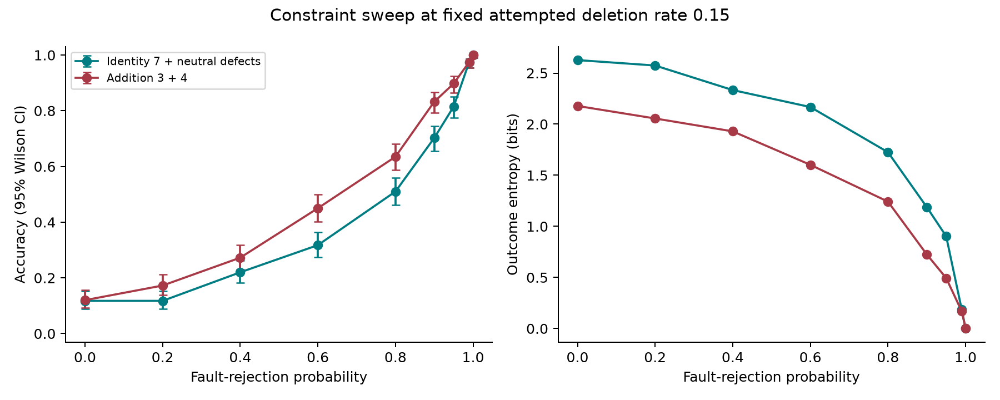
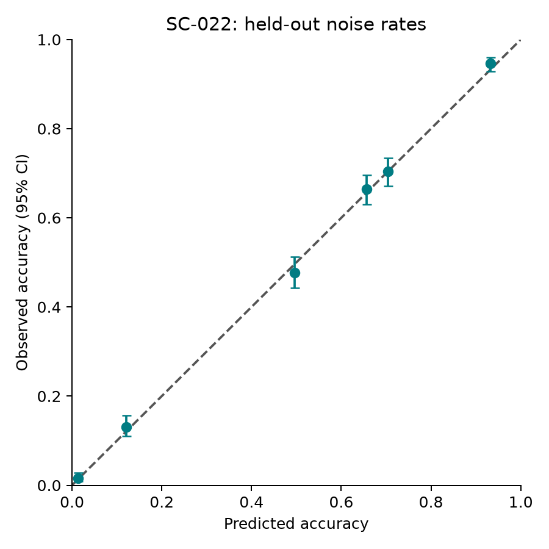

# Stochastic Calculator

A command-line research apparatus for RS/Nexology. Arithmetic is generated by
stochastic rewrites of relational populations; a separate conventional arithmetic
oracle verifies experimental results. The implementation deliberately exposes its
programmed rules, global coordination and representational assumptions.

**Measured conclusion:** exact outputs coexist with different stochastic paths,
including from an identical initial state. Conservation does not repair destroyed
charge. The measured constraint curve is consistent with a no-fit conventional
survival model. No unique RS mechanism or new physical implication was established.

Start with [RS_FINDINGS.md](RS_FINDINGS.md) for the research feedback, or
[RESEARCH.md](RESEARCH.md) for the experiment sequence. The foundational experiment
was run and interpreted before arithmetic was implemented.

**New constraint study (SC-023 through SC-025):** 2,100 additional trials use a
fixed broad random proposal grammar with separately switchable conservation,
growth and readiness rules. Programmed constraints are the subject, not cheating;
an answer oracle in the dynamics would be. Identity preservation, readable output
and persistence are measured separately. See [the notebook](research/CONSTRAINT_LAB.md)
and [actual results and intervals](research/constraint-analysis/RESULTS.md).

```bash
python3 -m rs_calc.constraint_lab --config configs/constraint-ablation.json --output research/runs/my-ablation
python3 -m rs_calc.constraint_lab --config configs/constraint-followups.json --output research/runs/my-followups
python3 -m rs_calc.constraint_lab --replay research/runs/constraint-ablation-v1
.venv/bin/python -m rs_calc.analyze_constraints research/runs/constraint-ablation-v1 research/runs/constraint-followups-v1 --output research/constraint-analysis
```

Run these from `stochastic-calculator`. This lab is a separate research kernel;
the usable calculator and its historical experiments remain unchanged. It tests
addition/signed cancellation, not a replacement implementation of all operators.

**Observer and recurrence follow-up (SC-026/027/027R):** two passive readouts expose
which earlier stability claims depend on readiness. A new answer-blind neutral-birth
bias permits repeated loss and recovery of readable form, without irreversible
growth/readiness gates. At 1% birth admission, pure readability occupied 95.43% and
94.92% of time in independent batches; the predeclared comparator predicted 95.02%.
This is readout recovery within a conserved identity, not repair of erased charge.
See [protocol and findings](research/RELAXATION_LAB.md) and
[measured results](research/dynamics-analysis/RESULTS.md).

```bash
python3 -m rs_calc.dynamics_lab --config configs/observer-controls.json --output research/runs/my-observers
python3 -m rs_calc.dynamics_lab --config configs/recurrent-resolution.json --output research/runs/my-recurrence
python3 -m rs_calc.dynamics_lab --replay research/runs/recurrent-resolution-v1
.venv/bin/python -m rs_calc.analyze_dynamics research/runs/observer-controls-v1 research/runs/recurrent-resolution-v1 research/runs/recurrent-replication-v1 --output research/dynamics-analysis
```

## Run

Python 3.11+; the calculator and tests require only the standard library.

```bash
cd stochastic-calculator
python3 -m rs_calc
python3 -m rs_calc '17 + 28' --seed 48271 --verbose
python3 -m rs_calc '13 / 3'
python3 -m rs_calc '(7 + 5) * 3 / 4'
python3 -m rs_calc '-13 / 3'
```

Install a named executable and optional plotting environment:

```bash
python3 -m venv .venv
.venv/bin/python -m pip install -e .
.venv/bin/python -m pip install -r requirements-research.txt
.venv/bin/rs-calc
```

The existing workspace already has this environment installed. On Windows outside
WSL, use `python` and `.venv\Scripts\python.exe`; module invocation works without
activating an environment. No server is required.

```text
rs-calc> 7 + 5
12
rs-calc> 17 + 28
45
rs-calc> ans * 2
90
rs-calc> 13 / 3
4 remainder 1
rs-calc> quit
```

Supports zero, signs, multi-digit integers, parentheses, precedence, and relational
chaining. `/` keeps quotient and remainder. `//` selects the **truncating** quotient,
not Python's negative floor convention; `%` selects the dividend-signed remainder.
Non-exact `/` results cannot be implicitly chained: use `(13//3)+1`. `ans` retains
the previous relational result and follows the same remainder rule.

Verbose/JSON mode reports seed, event count, trajectory hash and transition counts.
"Converged" means structural normal form, not verified numerical correctness.
A single run has no estimated statistical confidence; the CLI does not print a
fabricated `1.0000`. Input limits or nonconvergence produce an error and exit code 2.

## Research commands

```bash
python3 -m rs_calc experiment add 17 28 --runs 1000 --seed 100 --workers 4
python3 -m rs_calc sweep constraint add 3 4 --runs 400 --noise 0.15 --seed 100
python3 -m rs_calc perturb add 17 28 --perturbation neutral --runs 200 --seed 100
python3 -m rs_calc perturb add 17 28 --perturbation erase --runs 200 --seed 100
python3 -m rs_calc trace add 17 28 --seed 48271
python3 -m rs_calc carry 37 48 --seed 48271 --verbose
python3 -m rs_calc carry 100 -1 --seed 48271
```

`carry` is a separate decimal addition/subtraction experiment. The general
calculator uses unary populations and does not claim to require decimal carry.
Decimal gates implement transmit, carry and receive with fresh instances and a
ten-relation certificate. See [MECHANISMS.md](MECHANISMS.md) for the exact scope.

Research commands save complete manifests, source archives and compressed JSONL
logs in a new `research/runs/local-*` directory by default. Use `--output PATH` to
choose a location; existing run directories are never overwritten. Worker count
does not affect seeded dynamics. `--strength` controls fault rejection and `--noise`
controls attempted fault rate. Neutral-pair intervention is a different channel.

## Reproduce

```bash
python3 -m unittest discover -s tests -v
python3 -m rs_calc.foundation --output research/runs/local-foundation
python3 -m rs_calc.experiments --workers 4 --output research/runs/local-programme
python3 -m rs_calc.experiments --config configs/followups.json --workers 4 --output research/runs/local-followups
python3 -m rs_calc.experiments --config configs/reliability-holdout.json --workers 4 --output research/runs/local-holdout
.venv/bin/python -m rs_calc.analyze research/runs/addition-milestone research/runs/programme-v1 research/runs/followups-v1 research/runs/reliability-holdout-v1 research/runs/censoring-v2 --output research/analysis
```

The original programme was run in two stages: `--only SC-004 SC-005` for the addition
milestone and the remaining IDs for the broader programme. The manifest in each run
contains its exact selected cells and seeds; a complete new programme assigns seed
ordinals in its own cell order and is a fresh experiment, not byte-identical replay.

The deliverable records **87,800 experiment trials**, plus a **6,000-trial same-seed
SC-001 reproducibility rerun**. The latter is not independent evidence. Source
archives preserve code from each stage; initial SC-001 preceded automatic source
archiving, so its final-code rerun supplies a complete archived reconstruction and
reproduces all structural results. Timestamps and wall times naturally differ.

For a historical trial, `python3 -m rs_calc.replay RUN --seed SEED` checks the
recorded source fingerprints and reruns the trial. If the current tree has evolved,
extract that run's `source.tar.gz` into an **empty isolated directory**, then run
the replay module there with an absolute path to RUN. `--allow-source-change`
instead compares the current implementation and explicitly reports changed files.
Do not treat a changed-source replay as exact source reproduction.

SC-018 v1 logs count timeouts but lack incomplete-state snapshots; `censoring-v2`
adds those snapshots under `diagnostics.last_active_state`. Every converged record
has its initial and terminal populations. The historical limitation is preserved.

## Results and navigation

| Deliverable | Location |
| --- | --- |
| Research feedback | [RS_FINDINGS.md](RS_FINDINGS.md) |
| Notebook | [RESEARCH.md](RESEARCH.md), [continuation](research/NOTEBOOK.md) |
| Discoveries | [DISCOVERIES.md](DISCOVERIES.md) |
| Hypotheses and status history | [HYPOTHESES.md](HYPOTHESES.md) |
| Representation selection and architecture | [ARCHITECTURE.md](ARCHITECTURE.md) |
| Operation/constraint explanations and emergence audit | [MECHANISMS.md](MECHANISMS.md) |
| Statistics, intervals, error distributions | [RESULTS.md](research/analysis/RESULTS.md), [statistics.json](research/analysis/statistics.json) |
| Raw data, seeds, source archives | [research/runs](research/runs) |
| Literature comparators and PDE boundary | [SOURCES.md](research/SOURCES.md) |
| Test and repository validation | [VALIDATION.md](research/VALIDATION.md) |





Further exportable PNG/PDF figures cover [trajectory diversity](research/analysis/trajectory.png),
[covariance](research/analysis/covariance.png), [locality](research/analysis/locality.png),
[coordination ablation](research/analysis/coordination.png),
[occupancy](research/analysis/occupancy.png), and [scaling](research/analysis/scaling.png).

## Limits

The engine uses programmed conservation and rewrite rules. Multiplication creates
a global Cartesian relation registry; division uses global complete matching;
the syntax interpreter and convergence observer are centralized. The tested local
kernel is cancellation, not fully decentralized arithmetic. Unary magnitude and
product-state budgets limit scale. There is no autonomous physical energy model,
general erasure correction, claim of arithmetic arising without assumptions, or
demonstrated RS-specific predictive advantage.
